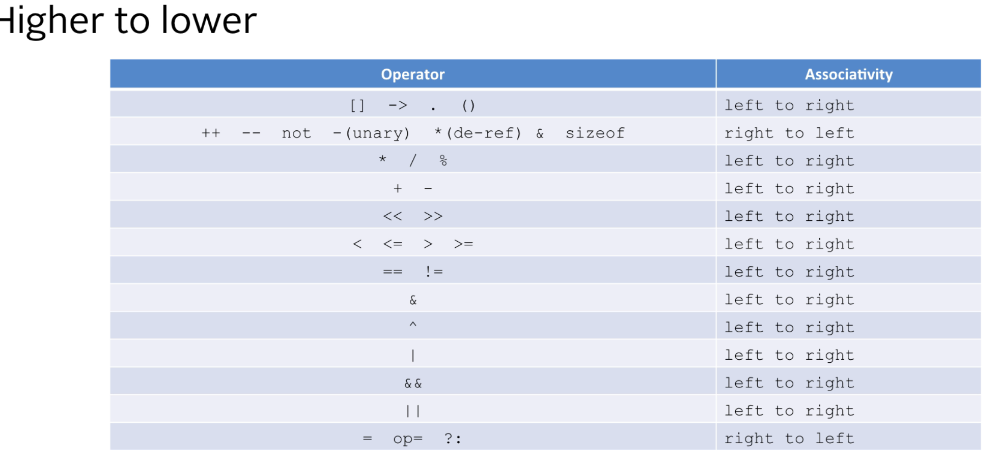
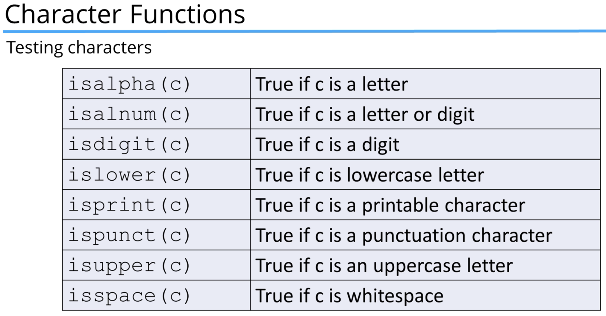
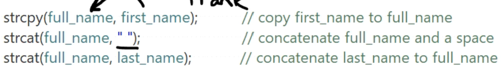
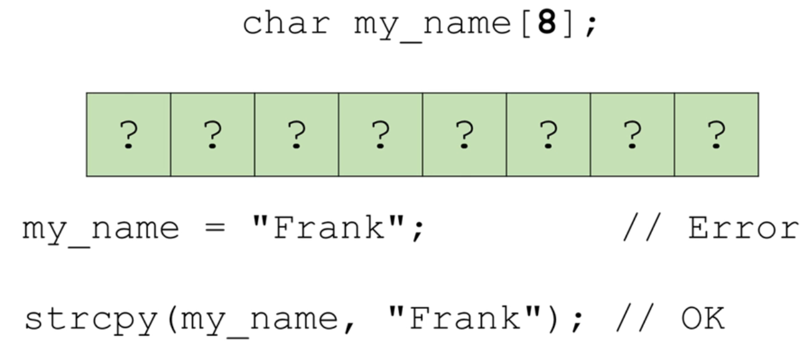

base(./cpp_images)

1. #### "Extern" KeyWord

> ****file1.h (header file)****
> 
> ```c
> #ifndef FILE1_H
> #define FILE1_H
> 
> extern int global_var; // declare global variable
> extern void print_message(); // declare function
> 
> #endif // FILE1_H
> ```
> 
> ****file1.c (source file)****
> 
> ```c
> #include "file1.h"
> 
> int main() {
>     global_var = 20; // access and modify global variable
>     print_message(); // call function
>     return 0;
> }
> ```
> 
> **file2.c (another source file)**
> 
> ```c
> #include "file1.h"
> 
> int main() {
>     global_var = 20; // access and modify global variable
>     print_message(); // call function
>     return 0;
> }
> ```

---

2. #### What is a preprocessor?
   
   > A preprocessor as the same suggests, is a program for preprocessing.
   > 
   > 1. It runs before compilation.
   > 2. **Text substitution**: Replacing macros and symbolic constants with their actual values.
   > 3. **File inclusion**: Inserting the contents of included files (like header files) into the source code.
   > 4. **Conditional compilation**: It selectively includes or excludes portions of code based on preprocessor directives such as `#ifdef`, `#ifndef`, `#if`, `#else`, and `#endif`.
   > 5. Also, It strips out the comments.
   > 6. 

---

3. #### main()
   
   > ```cpp
   > int main(int argc, char* argv[]){ //argc is argument_count, argument_vector
   >     // code
   > return 0;
   > }
   > ```
   > 
   > program argument1 arg2
   
   ---

4. #### Namespaces
   
   > ```cpp
   > std::cout<< "Heyy there!"<< endl;
   > ```
   > 
   > ```c
   > #include <iostream>
   > using std::cout;
   > using std::cin;
   > ```
   > 
   > ```c
   > #include <iostream>
   > using namespace std;
   > 
   > int main(){
   >     cin >> "Hey there! "<< endl;
   > }
   > ```

---

5. #### Variables
   
   > * Global variables are defaulted to zero.

---

6. #### Sizeof()
   
   > * Determines the size of a variable.
   > * sizeof(int) // of type
   > * sizeof(a)

---

7. #### DataTypes
   
   > * char - 1b
   > 
   > * short -2b
   > 
   > * int -4b
   > 
   > * long -4b
   > 
   > * long long - 8b
   > 
   > * --
   >   *Floating point integers:*
   > 
   > * Float -4b
   > 
   > * double -8b
   > 
   > * long double -12b
   >   ---
   >   
   >   **MACROS**
   >   
   >   * SHORT_MIN
   >   
   >   * INT_MIN/ INT32_MIN
   >   
   >   * INT64_MIN
   >   
   >   * LONG_MIN
   >   
   >   * **LLONG_MIN**

---

8. #### Constants
   
   > 1. *Literal Constants:*
   >    
   >    - 1.56
   >    
   >    - 12 - integer
   >    
   >    - 12U - Unsigned integer
   >    
   >    - 12L - a long integer
   >    
   >    - 12LL - a long long integer
   > 
   > 2. *Floating point literal constants:*
   > * 12.1 - a double
   > 
   > * 12.1F - a float
   > 
   > * 1L - a long double

---

9. #### Arrays

---

10. #### Vectors
    
    > * #include<vector>
    > 
    > * vector <int> v (100, 0 ) # (size, initial_val)
    > 
    > * v.at(0) = v[0]
    > 
    > * v.size()
    > 
    > * v.push_back()

---

11. #### Typecasting
    
    > static_cast<double>(100) // modern
    > (double)a // old style

---

12. #### Equals to
    
    > 10 == 10.0 // return True since left one is upcasted to higher dim
    > 
    > *Notes: 10 = 9.999999999999999999999999999999999999* returns true because of internal representation // tryout once

---

13. #### Operator precedence and Associativity
    
    > 

14. #### Cstyle Strings
    
    > 
    > 
    > 
    > 
    > **Errors in initializing csytle string:**
    > 
    > 

---

15. #### C++ Strings
    
    > ```cpp
    > #include<string>
    > string s1 {"Apple"};
    > string s2(10, 'X'); // XXXXXXXXXX
    > cout<< s2.length()<<endl;
    > ```
    > 
    > In cpp, strings are both mutable and immutable. Using const string makes immutable.
    > 
    > ```cpp
    > s1 = "Frank";
    > s1[0] = 'c'; //valid
    > 
    > 
    > 
    > // errors
    > s1 = "hey"
    > 
    > cout << "greet "+ s1 << endl // works fine
    > cout << "greet " + " me " + s1 // error why? '+' operator is overloaded and "greet" is cstyle string
    > // so "gree "+ "me" overloaded by + doesn't work on csytle strings
    > 
    > s1.substr(0,2) // he
    > s1.erase(0,1)//ey
    > size_t pos = s1.find(word)// if not found returns pos = string::npos
    > 
    > string fullname;
    > getline(cin, fullname) // handles spaces or stops until enter
    > 
    > s1.insert(pos, " ") // read it as insert at postion pos with char c
    > str.find('o', 3); // find a char o start search from idx 3
    > str.compare()
    > ```

---

16. #### Functions
    
    > 1. **prototype:** void fun( int var1, int var2); //valid
    >               void func(int, int); //valid
    > 
    > 2. **Default values for func:**
    >    Can be passed declared either in prototype (or) in function definition. Not in both
    >    
    >    *Note:* Default values should be at the tail of the func def

---

17. #### Static Variable
    
    > * The static variable is shared among all instances of a class
    > 
    > * *Static variable persists during the entire program*.
    > 
    > * Static variables are initialized only once.
    > 
    > * It can be modified **MODIFIED**
    > 
    > * ```cpp
    >   void func(){
    >       static int num {500};
    >       cout<< "num = "<< num<<endl;
    >       num += 500;
    >   }
    >   func() // prints num = 500
    >   func() // prints num = 1000; // won't be initialized again to 500
    >   ```
